# 🧵 Fabric Management System

A full-stack multi-platform system for managing fabric sales, orders, and delivery operations.

<div align="center">

### 🌐 Three Integrated Platforms

| 📱 User Mobile App | 🚚 Delivery Mobile App | 🖥️ Admin Web Dashboard |
|:---:|:---:|:---:|
| Browse, order & track | Manage & deliver orders | Analytics & administration |

</div>

---

## 🚀 Overview

Fabric Management System is a complete solution designed to handle the entire lifecycle of fabric orders — from browsing products to delivery and analytics.

It provides a seamless experience for **users**, efficient tools for **delivery personnel**, and powerful insights for **administrators**.

---

## 🧩 System Architecture

```
┌─────────────────┐    ┌──────────────────────┐    ┌─────────────────┐
│  📱 User App    │    │  🔥 Firebase Backend  │    │  🖥️ Admin Web   │
│   (Flutter)     │◄──►│  Auth + Firestore     │◄──►│   Dashboard     │
└─────────────────┘    │  + FCM Notifications  │    └─────────────────┘
┌─────────────────┐    └──────────────────────┘
│ 🚚 Delivery App │◄──►         ▲
│   (Flutter)     │       Google Maps
└─────────────────┘
```

---

## ✨ Key Features

<details>
<summary><b>👤 User Mobile Application</b></summary>

- 🛍️ Browse products and categories
- ❤️ Add to favorites
- 🛒 Add to cart and place orders
- 🎯 View offers and discounts
- 📦 Track order status: Shipped → Out for delivery → Delivered
- 📍 Select delivery location using Google Maps
- 🔔 Real-time notifications (FCM) for order updates & new offers
- ⭐ Review & rating system
- 🔐 Authentication: Email/Password, Google Sign-In, Email Verification

</details>

<details>
<summary><b>🚚 Delivery Mobile Application</b></summary>

- 📋 View assigned orders
- 🔄 Update order status in real-time
- 📍 View customer location on Google Maps
- 🗺️ Track route and distance to customer
- 🔔 Send real-time updates to users

</details>

<details>
<summary><b>🖥️ Admin Web Dashboard</b></summary>

- 📦 Manage products (Add / Edit / Delete)
- 🎯 Manage offers & discounts
- 👥 Manage users
- 📋 View all orders
- 📊 Analytics: Total orders, Revenue, Top products, Reviews
- 📤 Export reports to Excel

</details>

---

## 📸 Screenshots

### 👤 User App

<div align="center">

| Login | Home | Offers |
|:---:|:---:|:---:|
| 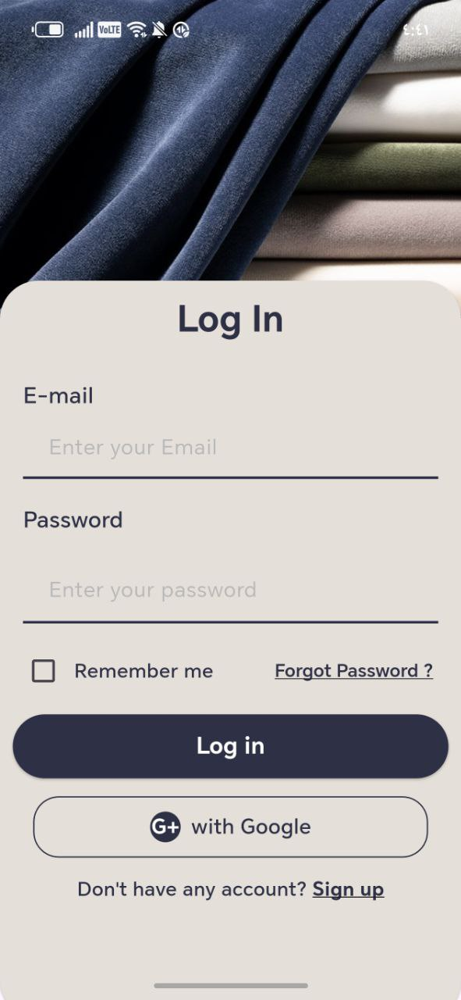 | 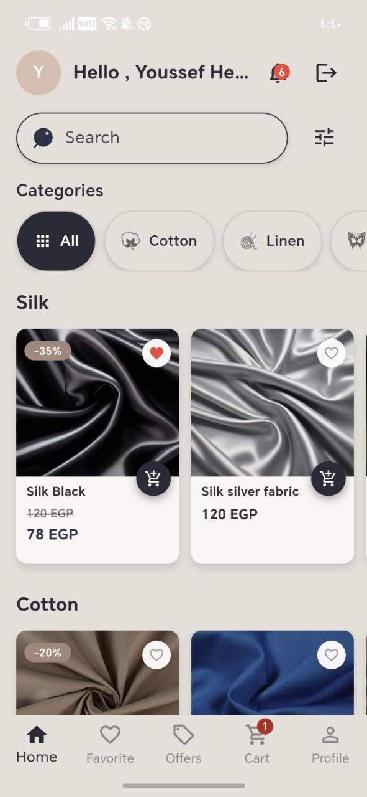 | 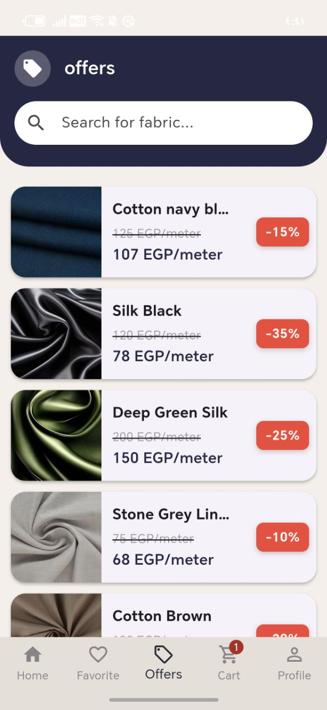 |
| **Login Screen** | **Home Screen** | **Offers & Discounts** |

| Favorites | Cart | Checkout |
|:---:|:---:|:---:|
| 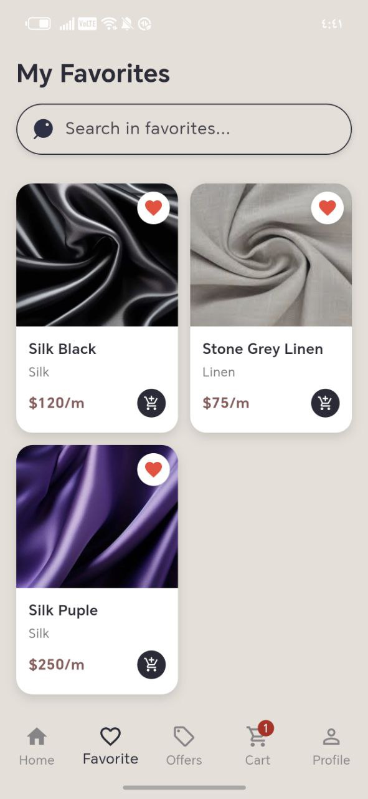 | 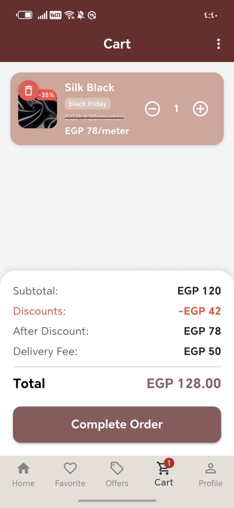 | 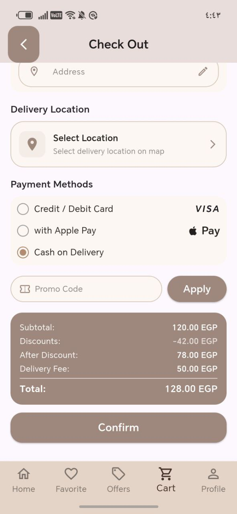 |
| **Favorites** | **Shopping Cart** | **Checkout** |

| Order Tracking | Location | Notifications |
|:---:|:---:|:---:|
|  | 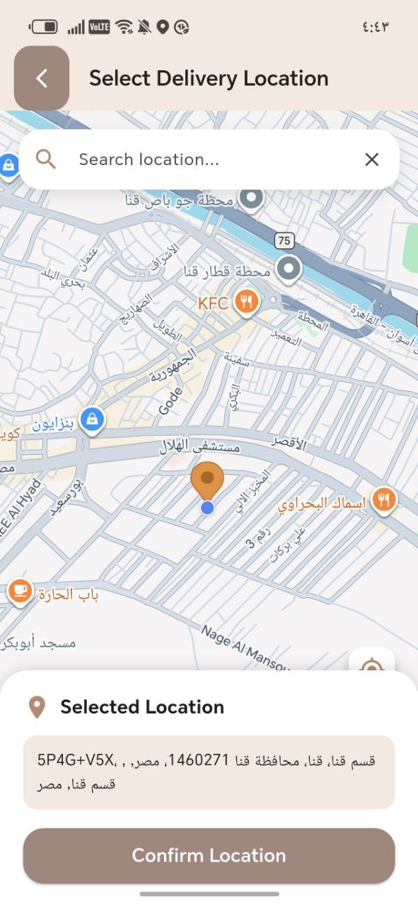 | 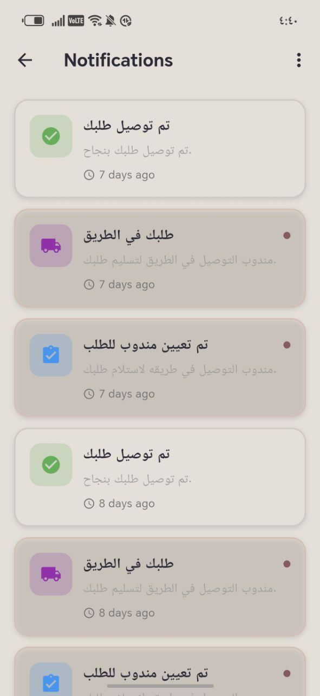 |
| **Track Order** | **Delivery Location** | **Notifications** |

</div>

---

### 🚚 Delivery App

<div align="center">

| Waiting Orders | Order Details | Customer Location |
|:---:|:---:|:---:|
| 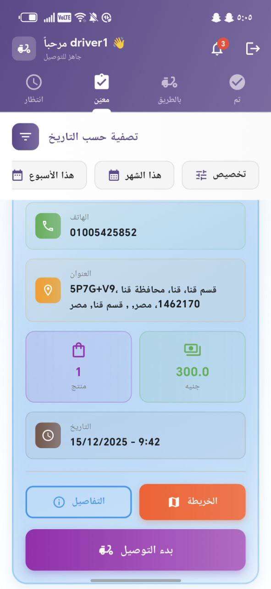 |  |  |
| **Pending Orders** | **Order Details** | **Customer Location** |

</div>

---

### 🖥️ Admin Dashboard

<div align="center">

| Dashboard Overview | Orders Page | Inventory |
|:---:|:---:|:---:|
| 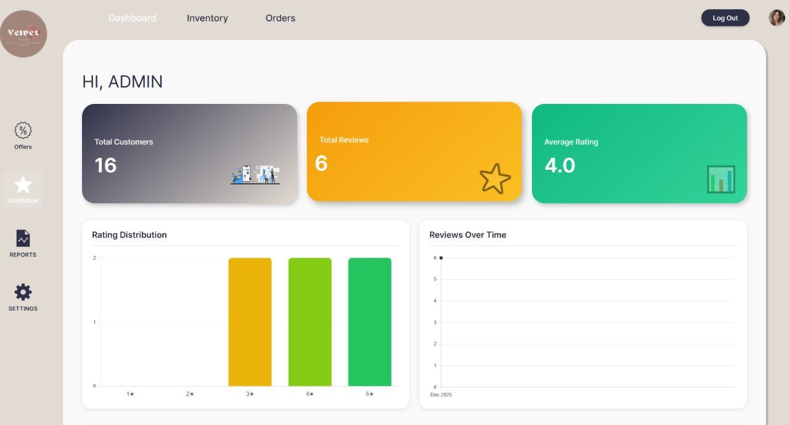 |  | 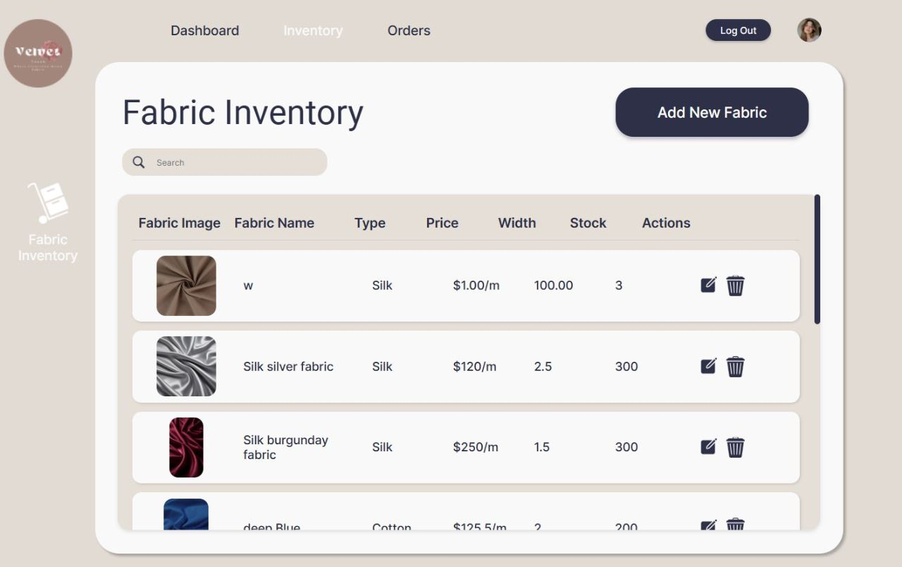 |
| **Main Dashboard** | **Orders Management** | **Inventory** |

| Add Fabric | Add Offers | Reviews |
|:---:|:---:|:---:|
| 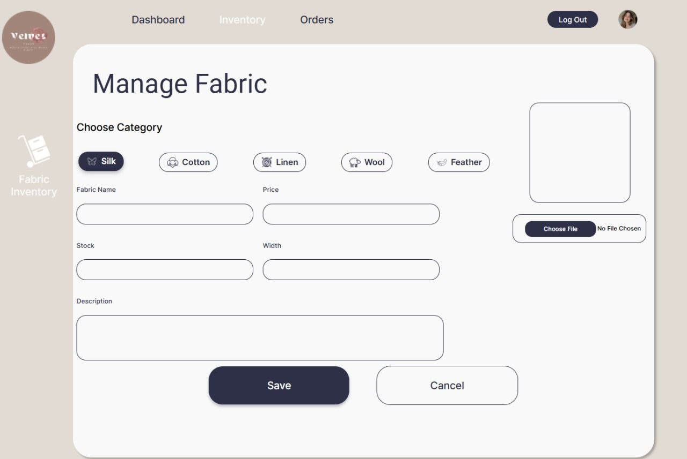 |  
| **Add New Fabric** | **Manage Offers** |  

| Analytics Chart 1 | Analytics Chart 2 | Analytics Chart 3 |
|:---:|:---:|:---:|
| 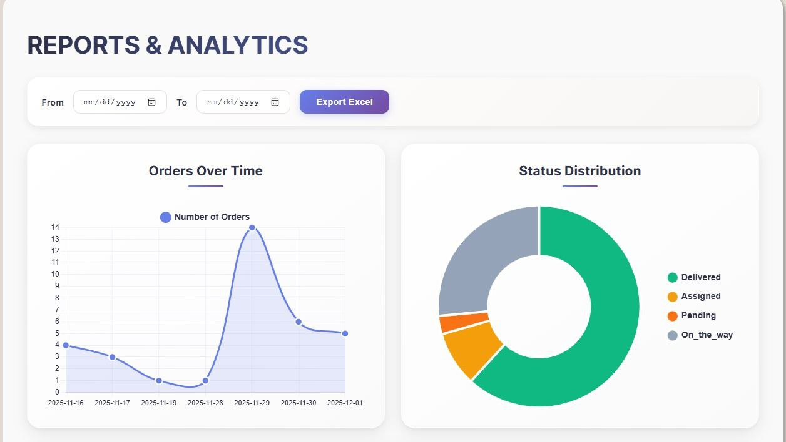 | 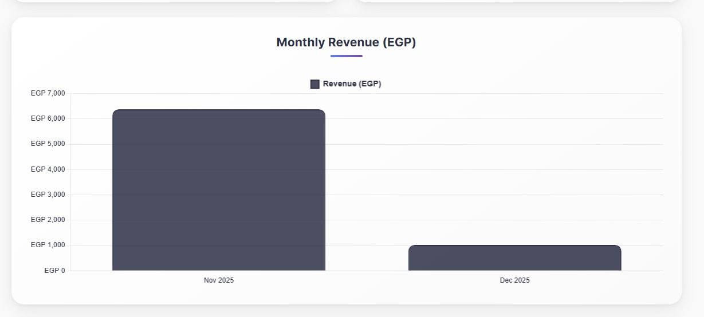 | 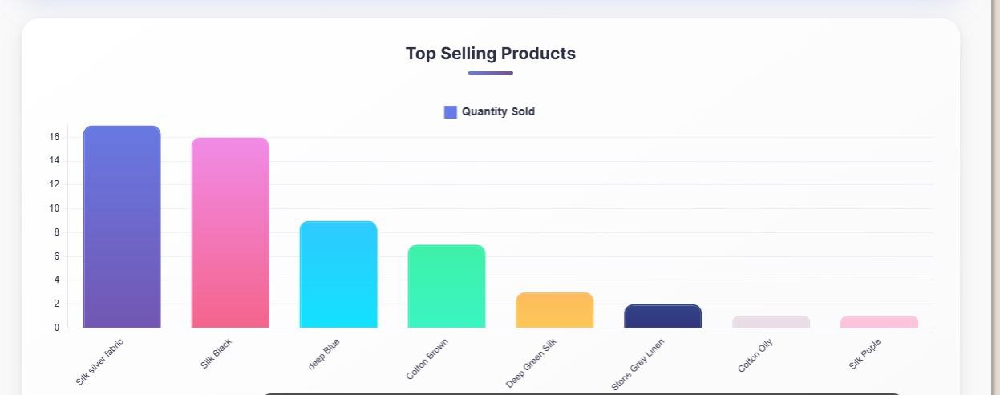 |
| **Revenue Chart** | **Orders Chart** | **Statistics** |

</div>

> 💬 **User Comments Panel**
>
> <div align="center">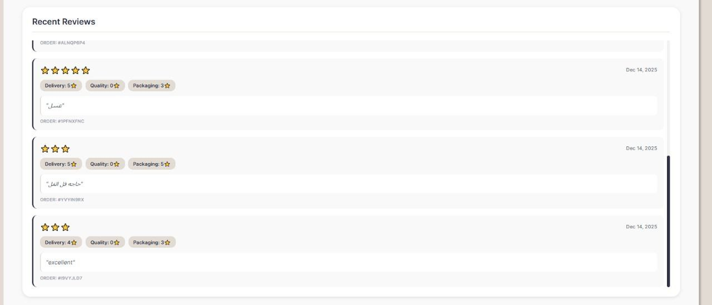</div>

---

## 🛠️ Tech Stack

<div align="center">

| Layer | Technology |
|:---|:---|
| 📱 Mobile Apps |   |
| 🌐 Web Dashboard |    |
| 🔥 Backend |    |
| 🗺️ Maps |  |
| ⚙️ Workflow |    |

</div>

---

## 🔔 Notifications System

Real-time push notifications via **Firebase Cloud Messaging**, triggered on:
- 📦 Order status updates (Shipped / Out for Delivery / Delivered)
- 🎯 New offers & promotions
- 🚚 Delivery updates

---

## 📊 Analytics & Reports

| Metric | Description |
|:---|:---|
| 📈 Monthly Revenue | Track revenue trends over time |
| 📦 Daily Orders | Monitor daily order volumes |
| 🏆 Top Products | Identify best-selling fabric items |
| 📤 Excel Export | Download reports for offline analysis |

---

## 📌 Project Status

> ✅ **Completed** &nbsp;&nbsp;|&nbsp;&nbsp; 🔒 **Source Code: Private**

---

## 👨‍💻 Author

<div align="center">

**Youssef Hesham**

[](https://github.com/youssef24413)
[](https://www.linkedin.com/in/youssef-hesham-sayed/)

</div>
