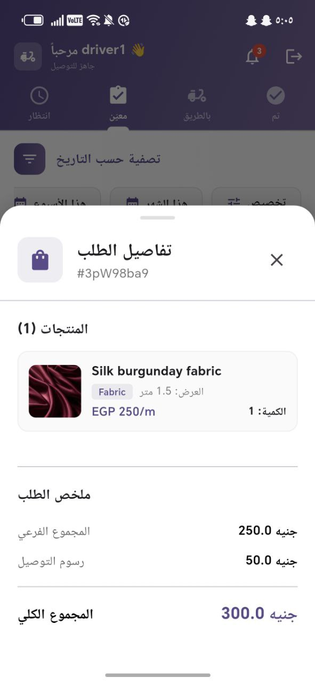
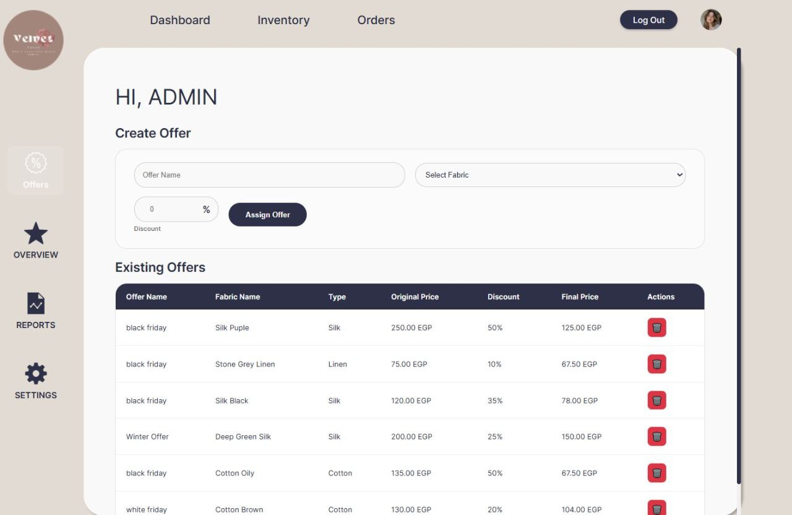
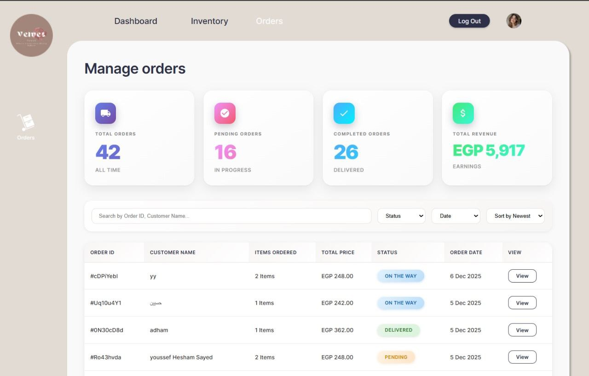

# 🧵 Fabric Management System

A full-stack multi-platform system for managing fabric sales, orders, and delivery operations.

The system consists of **three integrated platforms**:
- 📱 User Mobile App  
- 🚚 Delivery Mobile App  
- 🖥️ Admin Web Dashboard  

---

## 🚀 Overview

Fabric Management System is a complete solution designed to handle the entire lifecycle of fabric orders, from browsing products to delivery and analytics.

It provides a seamless experience for users, efficient tools for delivery personnel, and powerful insights for administrators.

---

## 🧩 System Architecture

- 📱 Mobile Apps (User & Delivery)  
- 🌐 Admin Web Dashboard  
- 🔥 Firebase Backend (Auth, Firestore, FCM)  

---

## ✨ Key Features

### 👤 User Mobile Application

- 🛍️ Browse products and categories  
- ❤️ Add to favorites  
- 🛒 Add to cart and place orders  
- 🎯 View offers and discounts  
- 📦 Track order status:
  - Shipped
  - Out for delivery
  - Delivered  
- 📍 Select delivery location using Google Maps  
- 🔔 Receive real-time notifications (FCM):
  - Order updates  
  - New offers  
- ⭐ Review & rating system  
- 🔐 Authentication:
  - Email & Password  
  - Google Sign-In  
  - Email Verification  

---

### 🚚 Delivery Mobile Application

- 📋 View assigned orders  
- 🔄 Update order status:
  - Shipped  
  - Out for delivery  
  - Delivered  
- 📍 View customer location on Google Maps  
- 🗺️ Track route and distance between delivery & customer  
- 🔔 Send real-time updates to users  

---

### 🖥️ Admin Web Dashboard

- 📦 Manage products:
  - Add / Edit / Delete  
- 🎯 Manage offers  
- 👥 Manage users  
- 📋 View all orders  
- 📊 Analytics Dashboard:
  - Total orders  
  - Delivered / Pending orders  
  - User reviews & comments  
  - Top-selling products  
  - Monthly revenue chart  
  - Daily orders chart  
- 📤 Export reports to Excel:
  - Daily orders  
  - Revenue  
  - System statistics  

---

## 🛠️ Tech Stack

### 📱 Mobile Development

### 🌐 Web Dashboard

### 🔥 Backend & Services

### 🗺️ Maps & Location

### ⚙️ Tools & Methodologies

---

## 📸 Screenshots

### 👤 User App

---

### 🚚 Delivery App

---

### 🖥️ Admin Dashboard

---

## 🔔 Notifications System

- Real-time notifications using Firebase Cloud Messaging  
- Triggered on:
  - Order status updates  
  - New offers  
  - Delivery updates  

---

## 📊 Analytics & Reports

- 📈 Monthly revenue tracking  
- 📦 Daily order statistics  
- 🏆 Top-selling products  
- 📤 Export data to Excel  

---

## 📌 Project Status

✅ Completed  
🔒 Source Code: Private  

---

## 👨‍💻 Author

**Youssef Hesham**

- GitHub: [https://github.com/youssef24413]
- LinkedIn: [https://www.linkedin.com/in/youssef-hesham-sayed/]  

---
